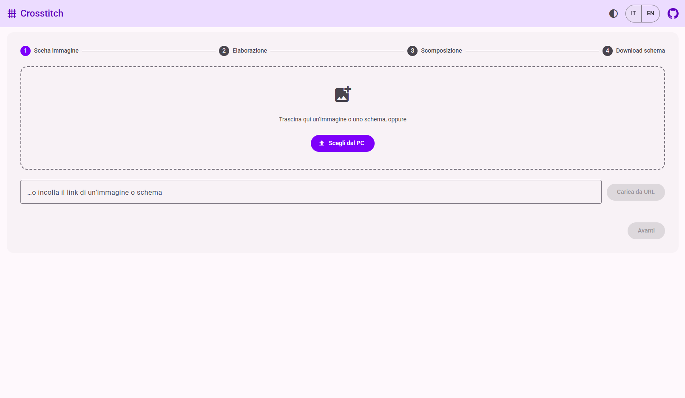
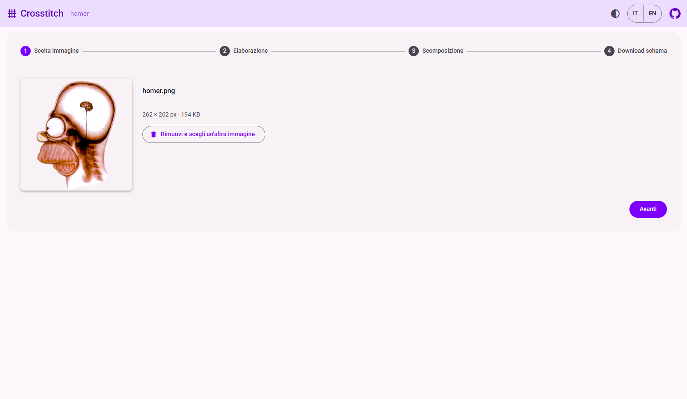
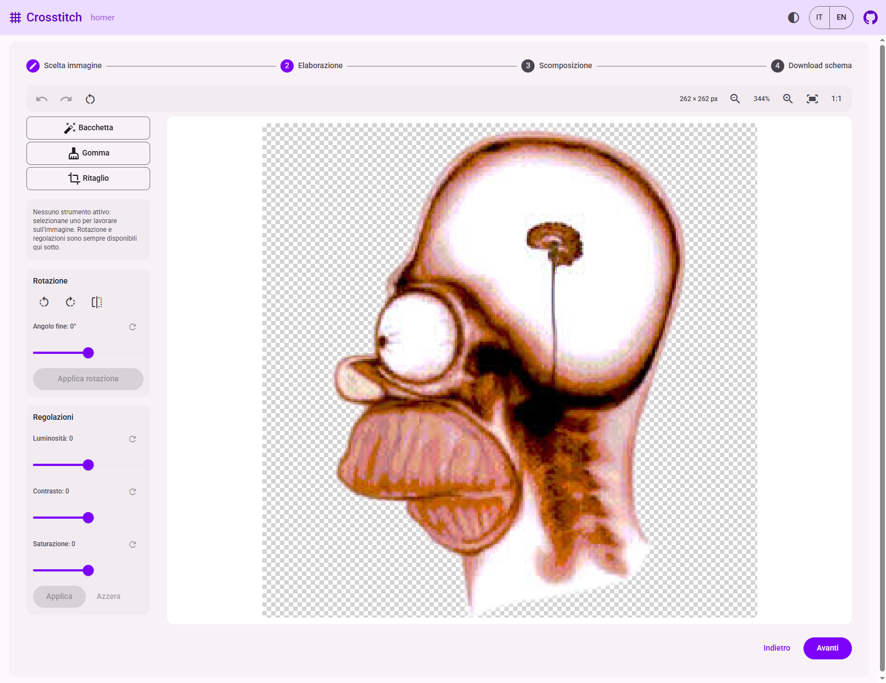
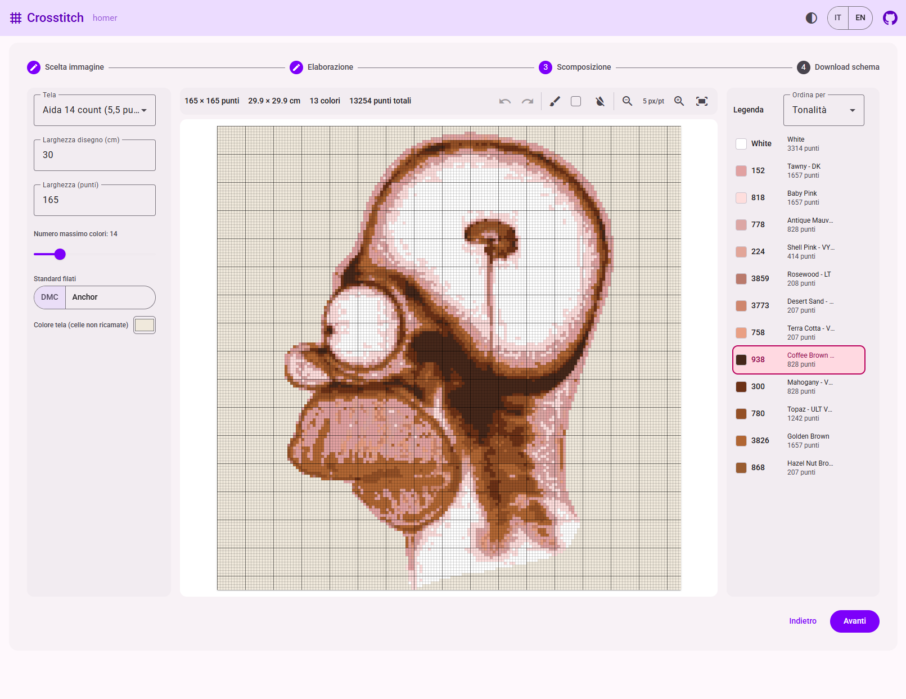
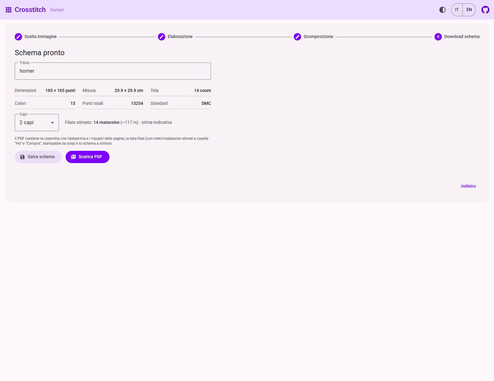
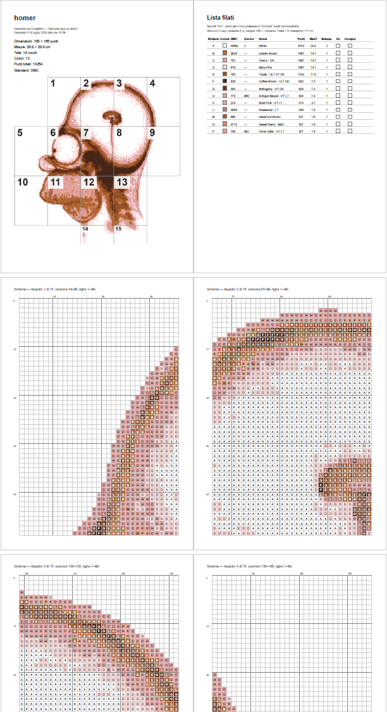

# Crosstitch

**➡ Prova l'app: [crosstitch.app](https://crosstitch.app/)**

Web app che trasforma una qualsiasi immagine in uno **schema per punto croce** pronto da stampare: PDF con schema a simboli, lista filati DMC/Anchor e stima del filato necessario.

Tutta l'elaborazione avviene **nel browser**: le immagini non vengono caricate su alcun server e lo schema può essere salvato in un file locale riapribile in seguito.

---

## Come funziona (guida per chi usa l'app)

L'app è un wizard in quattro passi: si parte da un'immagine e si arriva al PDF dello schema. Dalla toolbar sono sempre disponibili il tema (chiaro/scuro/auto) e la lingua (IT/EN).

### 1 · Scelta immagine



Si carica l'immagine di partenza in tre modi: trascinandola nella pagina, scegliendola dal PC o incollando il link di un'immagine sul web. Dalla stessa schermata si può anche riaprire uno **schema salvato in precedenza** (file `.xstitch`, vedi più sotto).



Una volta caricata, l'immagine viene mostrata in anteprima con nome, dimensioni e peso; il nome del file diventa il titolo di lavoro (modificabile all'ultimo passo).

### 2 · Elaborazione



Un piccolo editor permette di preparare l'immagine prima della conversione:

- **Bacchetta** — rende trasparenti le aree di colore uniforme (tipicamente lo sfondo): le zone trasparenti diventeranno celle non ricamate dello schema;
- **Gomma** — cancella a mano libera;
- **Ritaglio** — ritaglia l'inquadratura;
- **Rotazione** — rotazioni di 90°, specchiatura e angolo fine con lo slider;
- **Regolazioni** — luminosità, contrasto e saturazione.

Ogni operazione è annullabile (undo/redo) e il canvas supporta zoom e adattamento alla finestra.

### 3 · Scomposizione



È il cuore dell'app: l'immagine viene convertita in una griglia di punti, ognuno associato al filato più vicino per colore. Si controllano:

- **Tela** — il tipo di Aida (es. 14 count = 5,5 punti/cm), da cui deriva la misura reale;
- **Larghezza** — in centimetri o in punti (i due campi sono sincronizzati);
- **Numero massimo di colori** — per semplificare lo schema;
- **Standard filati** — codici **DMC** o **Anchor**;
- **Colore tela** — usato per visualizzare le celle non ricamate.

La barra in alto riepiloga in tempo reale dimensioni, misura, numero di colori e punti totali. La **legenda** a destra elenca i filati con codice e conteggio punti (ordinabile per tonalità o per quantità); selezionando un colore si possono ritoccare a mano le singole celle direttamente sulla griglia, con undo/redo.

### 4 · Download schema



L'ultimo passo riepiloga lo schema (dimensioni, misura, tela, colori, punti totali, standard) e permette di:

- impostare il **titolo** dello schema;
- scegliere il numero di **capi** con cui si ricamerà, da cui viene calcolata la **stima del filato** (matassine e metri, indicativa);
- **salvare lo schema** in un file `.xstitch` per riaprirlo in seguito;
- **scaricare il PDF** pronto per la stampa.

### Il PDF generato



Il PDF contiene:

- la **copertina** con l'anteprima, i dati dello schema e la mappa dei riquadri numerati;
- la **lista filati** con simbolo, codici DMC/Anchor, nome, punti, metri e matassine stimati, più le caselle "Ho" e "Compra" da spuntare per fare la spesa (stampabile anche da sola);
- lo **schema a simboli**, suddiviso in riquadri con le coordinate di righe e colonne per orientarsi durante il ricamo.

### Il file `.xstitch`

"Salva schema" produce un file JSON autocontenuto: include l'immagine originale, le modifiche dell'editor, tutte le opzioni e la griglia dei punti. Riaprendolo (al passo 1, come una normale immagine) si riparte esattamente da dove si era rimasti, per modificare o rigenerare lo schema.

---

## Per chi sviluppa (o vuole forkare)

Monorepo [Nx](https://nx.dev) con tre progetti:

| Progetto | Percorso | Stack |
| --- | --- | --- |
| `frontend` | `apps/frontend` | Angular 22 (zoneless, signals, standalone) + Angular Material (M3) |
| `backend` | `apps/backend` | NestJS 11 + Mongoose (MongoDB) |
| `floss-colors` | `packages/floss-colors` | Lib condivisa: catalogo colori DMC/Anchor + conversioni colorimetriche (Lab, CIEDE2000) |

### Architettura in breve

Il principio guida è che **tutta l'elaborazione è client-side**: editing, quantizzazione dei colori, matching con i filati e generazione del PDF (con [pdf-lib](https://pdf-lib.js.org/)) girano nel browser su canvas e typed array. Il backend è minimale e serve solo ciò che il browser non può fare da solo.

```
apps/frontend/src/app/
├── features/pattern-wizard/     # la feature principale (wizard a 4 step)
│   ├── pattern-wizard.ts        # contenitore dello stepper
│   ├── pattern-draft-store.ts   # stato del wizard (signal store)
│   ├── steps/                   # componenti dei singoli step
│   ├── editor/                  # step 2: canvas, strumenti, operazioni raster
│   ├── decompose/               # step 3: quantizzazione, matching filati, ritocchi
│   ├── download/                # step 4: PDF, simboli, stima filato
│   └── persistence/             # formato .xstitch e salvataggio/caricamento
├── i18n/                        # traduzioni it/en, servizio e pipe
└── theme/                       # tema chiaro/scuro/auto (Material M3)
```

Lo stato del wizard vive in `PatternDraftStore` (signals); la logica di calcolo (scomposizione, ritocchi, simboli, stima, serializzazione) è in **funzioni pure senza DOM**, testate con unit test — è il punto di ingresso migliore per capire il codice.

Il **backend** (NestJS) espone:

- `GET /api/image-proxy?url=…` — proxy per le immagini caricate da URL: evita il canvas CORS-tainted e blocca gli host locali/privati;
- `GET /api/patterns` — dati statici provvisori (base per un futuro catalogo);
- in produzione serve anche la build del frontend via `ServeStaticModule`.

La connessione MongoDB (Mongoose) è predisposta ma **commentata** in `apps/backend/src/app/app.module.ts`: il backend gira senza database. Decommentare il blocco `MongooseModule` quando servirà.

Il package **`floss-colors`** contiene il catalogo dei filati DMC/Anchor e la matematica colorimetrica (conversioni sRGB→Lab, distanza CIEDE2000) usata per associare ogni cella al filato più vicino.

### Requisiti e primi passi

Node **24 LTS** consigliato (Angular 22 richiede `^22.22.3 || ^24.15.0 || >=26`), npm ≥ 10.

```sh
npm install

# frontend su http://localhost:4200 (proxya /api verso il backend, se attivo)
npx nx serve frontend

# backend su http://localhost:3000/api (avviarlo a parte quando serve)
npx nx serve backend
```

### Configurazione

Copia `.env.example` in `.env` e adatta i valori. Il backend legge:

- `MONGODB_URI` — connessione MongoDB (default `mongodb://localhost:27017/crosstitch`); usata solo quando il modulo Mongoose è attivo;
- `PORT` — porta del backend (default `3000`).

### Task utili

```sh
npx nx test frontend                  # unit test (vitest)
npx nx run-many -t typecheck test     # typecheck + test di tutti i progetti
npx nx run-many -t build lint test    # tutto
```

### Build e deploy

```sh
npm run build   # gulp deploy: pulisce dist/ e builda frontend + backend in produzione
npm start       # node dist/apps/backend/main.js
```

La build del frontend finisce in `dist/apps/backend/public` ed è servita dal backend: in produzione gira **un solo processo Node**. Il repo è pronto per Heroku (`Procfile`: `web: npm start`; la versione di Node è bloccata a `24.x` in `engines`).
